<!doctype html>
<html lang="en">
  <head>
    <meta charset="utf-8">
    <meta name="viewport" content="width=device-width, initial-scale=1, shrink-to-fit=no">
    <link rel="stylesheet" href="bootstrap/css/bootstrap.min.css">
    <link rel="stylesheet" href="css/style.css">
    <title>Dota Debuff</title>
  </head>

  <body>

    <header>
        
 
            <nav class="navbar navbar-expand-lg">
                

                    
                    Dota debuff
                

                <button class="navbar-toggler" type="button" data-toggle="collapse" data-target="#navbarSupportedContent" aria-controls="navbarSupportedContent" aria-expanded="false" aria-label="Toggle navigation">
                    
                </button>
                

                    <ul class="navbar-nav ml-auto lox">
                        <li class="kk">
                            <a class="zeb" href="#">Path Notes</a>
                        </li>
                        <li class="kk">
                            <a class="zeb" href="#">Cyber News</a>
                        </li>
                        <li class="kk">
                            <a class="zeb" href="#">Actual Media</a>
                        </li>
                    </ul>
                

            </nav>
        
  
    </header>

    

        

            <ol class="carousel-indicators">
                <li data-target="#carouselExampleIndicators" data-slide-to="0" class="active"></li>
                <li data-target="#carouselExampleIndicators" data-slide-to="1"></li>
                <li data-target="#carouselExampleIndicators" data-slide-to="2"></li>
            </ol>
            

                

                    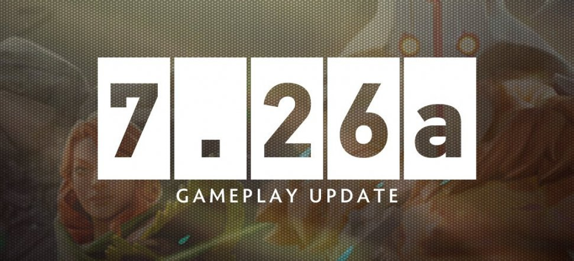
                

                

                    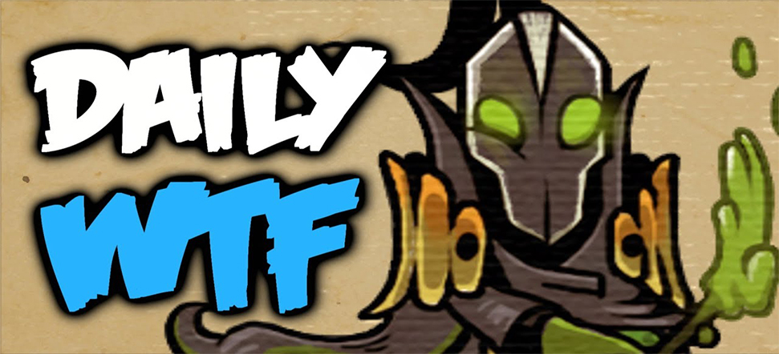
                

                

                    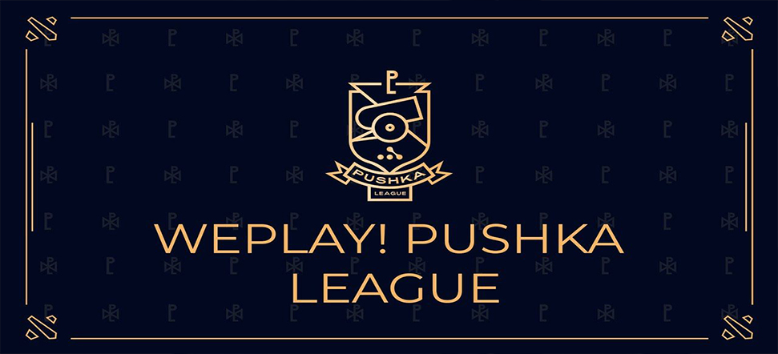
                

            

            <a class="carousel-control-prev" href="#carouselExampleIndicators" role="button" data-slide="prev">
                
                Previous
            </a>
            <a class="carousel-control-next" href="#carouselExampleIndicators" role="button" data-slide="next">
                
                Next
            </a>
        

    

    <h3 class="maintexts container">Patch notes</h3>
    

        

            <h1 class="patchesunits">7.26a</h1>
            

                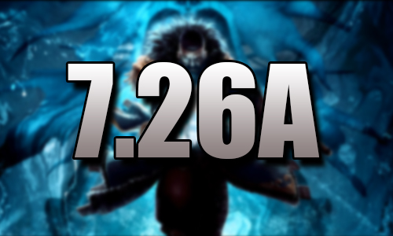
                

                    This patch is a continuation of 7.26 which made changes to the economy. In this balanced patch, the characters and objects were changed ...
                

            

        

        

            <h1 class="patchesunits">7.26</h1>
            

                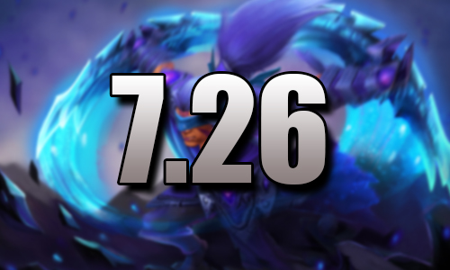
                

                    This patch makes a difference in the economy and greatly changes the comeback system ....
                

            

        

    

    <h3 class="maintexts container">Cyber Sport</h3>
    <h3 class="maintexts tm container">Tournaments</h3>
    

        

            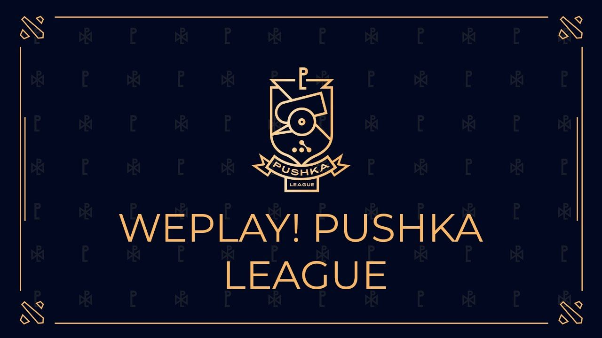
                
While the whole world is on pause, and people are pondering what they
                    should watch online, we don’t think - we do! Meet WePlay! Pushka 
                    League - new WePlay project! Esports. Our Dota 2 league will run from 
                    April 20 to May 11. The 14 best teams from the CIS and Europe will 
                    converge in a single online tournament with a powerful prize pool of 
                    $ 250,000.

        

    

    <h3 class="maintexts container">Interesting recent matches</h3>
    

        

            <h1 class="patchesunits">VP vs VP.Prodigy</h1>
            

                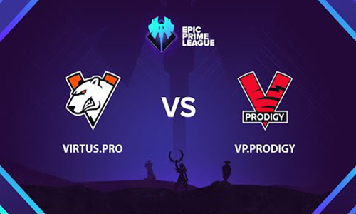
                

                    As part of the Epic Prime Leage tournament, a match was held between VP and their second squad VP.Prodigy. Watch the battle of two teams on the same team.
                

            

        

        

            <h1 class="patchesunits">HellRaisers vs Na’Vi</h1>
            

                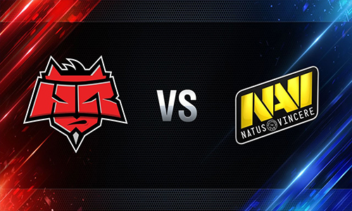
                

                    Na'Vi fought with HellRaisers aspart of the WePlay tournament. This match is interesting with anaggressive game of both teams.
                

            

        

    

    <h3 class="maintexts container">Actual media</h3>
    

        

            

                

                    

                        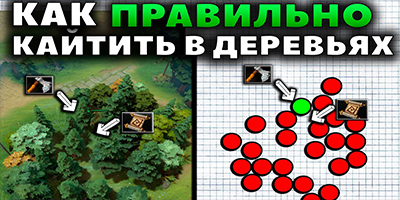
                        

                            
Xeno in this video will tell you
                                the forests in Dota 2, as well 
                                as teach you to cheat the 
                                enemy in all the main places 
                                on the map

                        

                    

                

                

                    

                        
                        

                            
The next release of Dota WTF 
                                with a good game made by 
                                the player on the rubik.

                        

                    

                

                

                    

                        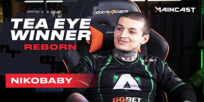
                        

                            
Tea Eye Winner with Aliance's 
                                Nikobaby from Maincast 
                                Studios.. Look after his 
                                successes.

                        

                    

                

                

                    

                        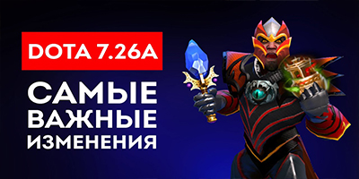
                        

                            
In this video, MetaGame will 
                                tell you about the most 
                                important changes to update 
                                7.26a.

                        

                    

                

            

        

    

    
    
    
    
  </body>
</html>
